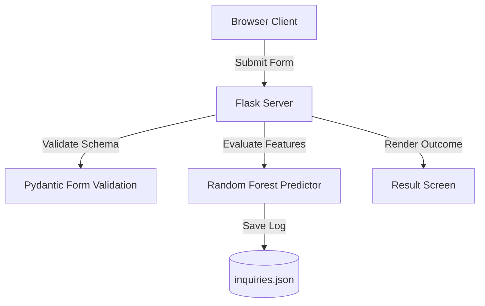

# Phase 3: Project Design

## 🏛️ System Architecture
The application is designed using a lightweight Flask framework serving HTML5 templates styled with modern Tailwind CSS utilities.



## 📊 Database Layout
评估记录以 JSON 结构保存在本地 `inquiries.json` 中：
```json
[
    {
        "full_name": "Applicant Name",
        "income": 145000.00,
        "age": 42,
        "income_type": "Commercial associate",
        "decision": "Approved",
        "date": "July 06, 2026"
    }
]
```
